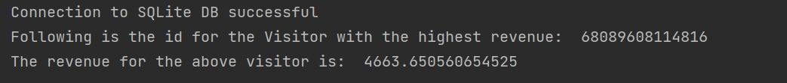

# FELD M - TECH TASKS

Author: Sana Ghani

### Task 1
#### Write a Python script to find out which visitor created the most revenue. 
#### Note: A simple print of the result to the console is sufficient.

To execute the task, run `python3 Task1.py`. 

Screenshot of the result:
